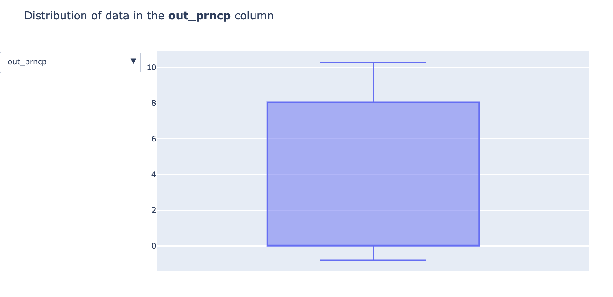
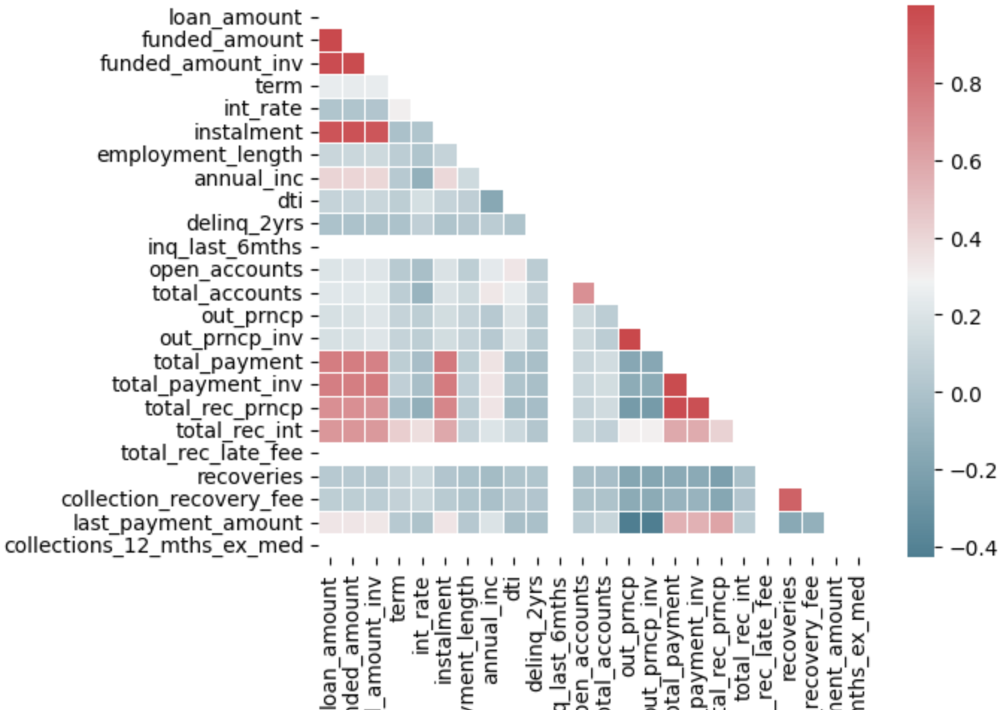
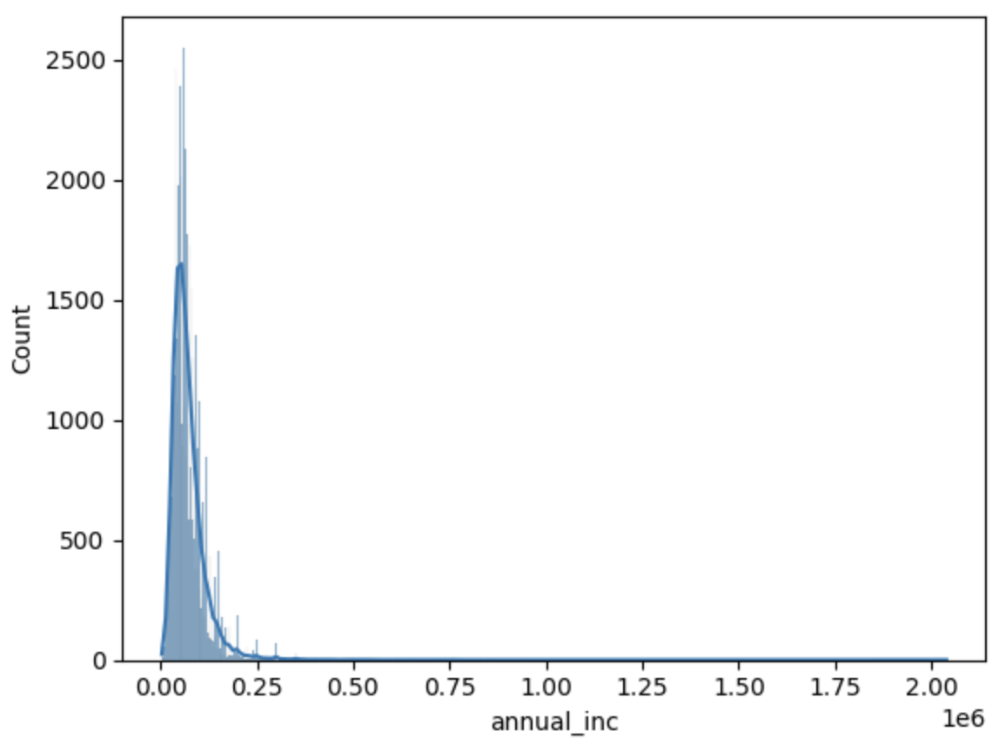
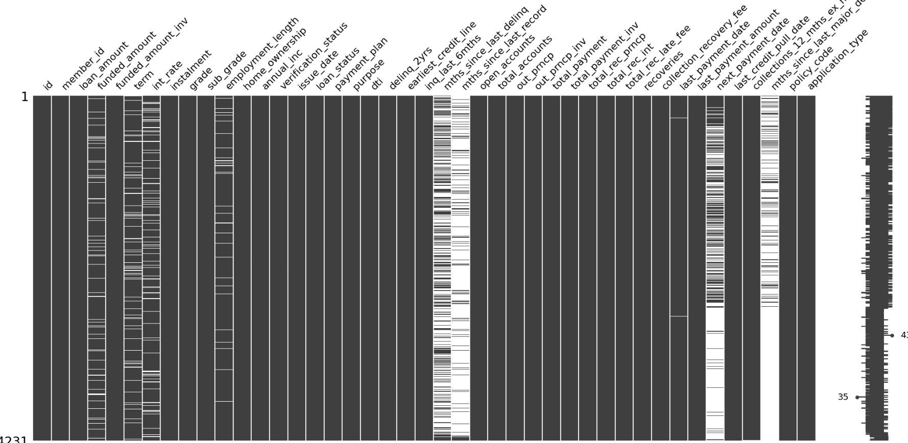

# exploratory-data-analysis---customer-loans-in-finance

## Contents
1. [Description](#description)
1. [Installation instructions](#installation-instructions)
1. [Usage instructions](#usage-instructions)
1. [File structure](#file-structure)
    - [analysis/ipynb](#analysisipynb)
    - [db_utils.py](#db_utilspy)
    - [loan_payments.csv](#loan_paymentscsv)
    - [familiarise_with_data.ipynb](#familiarise_with_dataipynb)
    - [create_df.py](#create_dfpy)
    - [df_EDA.py](#df_edapy)
    - [Data_Post_Transformation.csv](#data_post_transformationcsv)
    - [df_transformations.yaml](#df_transformationsyaml)
    - [drops_and_imputations.yaml](#drops_and_imputationsyaml)
    - [requirements.txt](#requirementstxt)

1. [License information](#license-information)

## Description
This project accesses a relational database and extracts data for exploratory data analysis.
Two ipynb files document some analysis undertaken on the data extracted.

I learnt how to use SQLAlchemy to connect to a database as well as how to structure this within a class by use of the  __ enter __ and __ exit __ magic methods. I developed my use of classes in order to create classes and associated functions for potential reuse in future projects.

I also learnt how to keep login details out of scripts by use of the separate .yaml file in the directory, and using .gitignore to prevent this information being shared to the Github repository.

I developed my ability to document my project appropriately via the README.md file.

As well as visualising data, I transformed it, removed outliers and imputed missing values based on the characteristics of the columns in the data.

## Installation instructions

The requirements.txt file in the project folder contains a breakdown of the packages required to run this project.

In order to establish a connection to the database, db_utils. py requires a .yaml file (with database connection credentials) to be saved in the same directory. Values need to be populated against the following keys:

- RDS_HOST: {link/id for the database}
- RDS_PASSWORD: {password for the user to access the  database}
- RDS_USER: {username for the user to access the  database} 
- RDS_DATABASE: {name of database}
- RDS_PORT: {port to be accessed}

## Usage instructions

A yaml file with database log-in credentials is required in order to establish the database. This should be stored in the same directory as the scripts.
- running db_utils.py as a script will require this file to be called 'credentials.yaml'. The class is written in such a way to allow any named yaml file to be called when the class is imported as a module

## File structure

### analysis.ipynb

Final visualisations and insights into the dataset once it had been extracted and transformed.

### db_utils.py

This file initiates a class (RDSDatabaseConnector) which establishes a connection with the database. 
Subsequent functions in this file run a specific query in the database to extract loan patyment information and save this to a .csv file (loan_payments.csv).

### loan_payments.csv

This is the .csv file generated from data extracted by the db_utils.py script

### familiarise_with_data.ipynb

This .ipynb file details the steps taken whilst I familiarised myself with the raw data in load_payments.csv. Steps taken include:

- inspection of the head of the dataframe
- checking the shape of the dataframe
- checking the datatype of each column
- checking potential categorical columns
- checking the percentage of null values per columns

### create_df.py

This python script includes the DataTransform class which performs the following actions:
- converts specified columns to specified datatypes
- replaces specified text in specified columns

This script also includes the DataFrame info class which returns the following information:
- Summary statistics for each numeric column in the dataframe
- The dtypes for each dataframe column
- The number of distinct values in each categorical column
- The shape of the dataframe
- The percentage of null values per column
- The skew for each column

Running the script outputs a transformed version of the laon_payments.csv file with changes as specified in the 'df_transformations.yaml' file

### df_EDA.py

This file includes the Plotter class and the DataFrameTransform class. The Plotter class produces a number of visualisations includings:

- <b>Box plot</b>: for outlier identification. Columns are navigated through via the dropdown 

- <b>Heat map</b>: for identifying collinearity between columns 

- <b>Histogram</b>: for visualising the distribution of data in columns

- <b>Missing values</b>: to see the spread of missing values within the data

### Data_Post_Transformation.csv

The updated data following the transformations run in the df_EDA.py file (when running the script)

### df_transformations.yaml

This yaml file specifies the columns and types of transformations to be applied to the dataframe upon initial data exploration (updating dtypes, trimming text and so on)

### drops_and_imputations.yaml

This yaml file specifies the imputations to be performed on the data

### requirements.txt

A file detailing the required packages in order to run the project

## License information
None